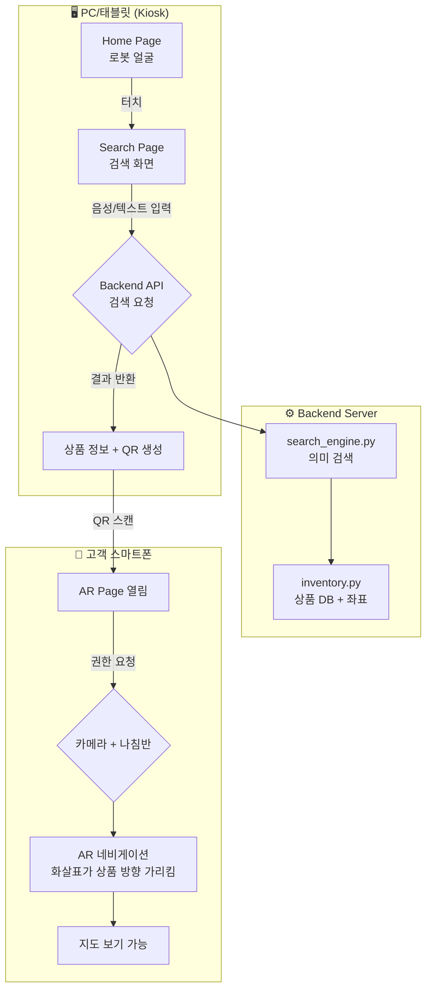
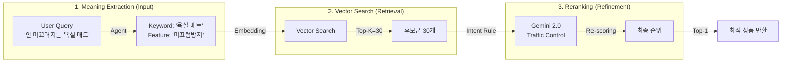
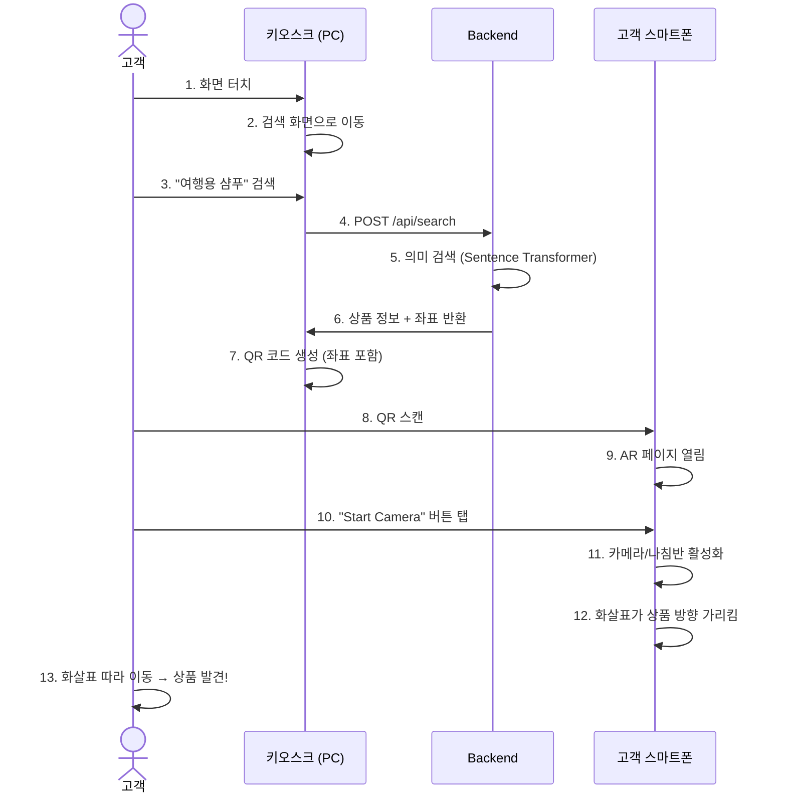
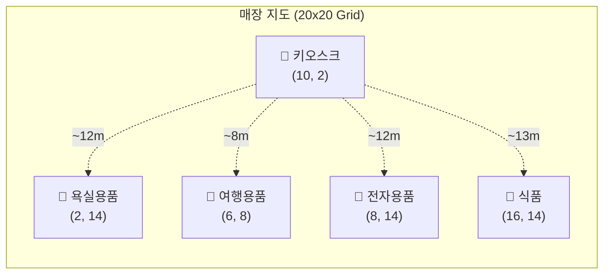

# Search-Roca 전체 워크플로우

## 시스템 구성도



---

## 핵심 검색 아키텍처 (RAG Pipeline) v0.6.0



---

## 사용자 여정



---

## 좌표 시스템



---

## 서버 구성 (4개 터미널)

| # | 용도 | 명령어 | 포트 |
|---|------|--------|------|
| 1 | Backend 서버 | `python main.py` | 8000 |
| 2 | Backend 터널 | `npx.cmd localtunnel --port 8000 ...` | - |
| 3 | Frontend 서버 | `npm start` | 3000 |
| 4 | Frontend 터널 | `npx.cmd localtunnel --port 3000 ...` | - |

---

## 핵심 알고리즘: 화살표 방향 계산

```
목표 방위각 = atan2(상품X - 사용자X, 상품Y - 사용자Y)
화살표 회전 = 목표 방위각 - 폰 나침반 각도
```

이렇게 하면 **폰을 돌려도 화살표는 항상 상품을 가리킴** (포켓몬고 스타일)
